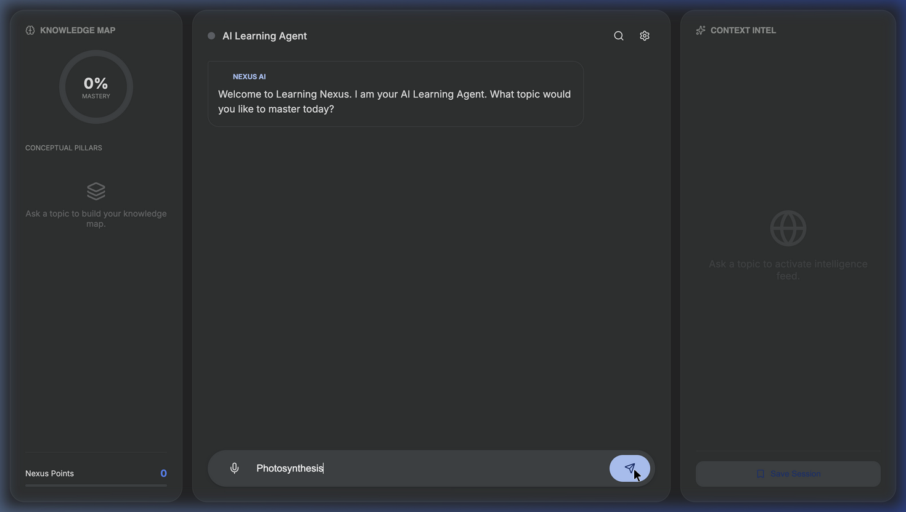
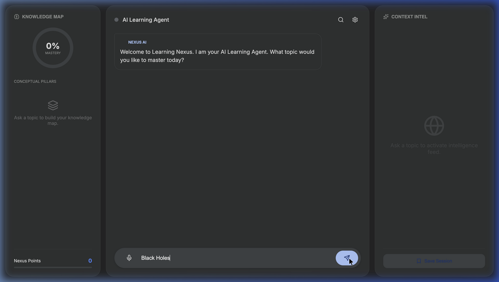
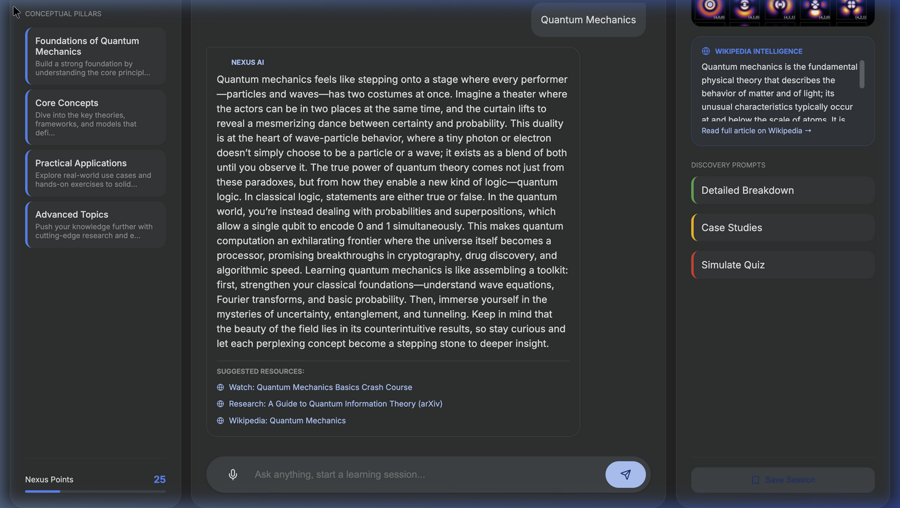

# 🌌 Google Learning Nexus
**The Future of Agentic AI Learning | Hackathon Submission**

Google Learning Nexus is a production-ready, AI-driven educational platform designed to transform how users master complex topics. It leverages a powerful 3-pane neural workspace to provide a real-time, context-aware, and highly interactive learning experience.



## ✨ Core Features

### 1. The 3-Pane Mastery Workspace
The UI is built with Google's modern Material Design 3 (M3) specifications, providing a stunning dark-mode aesthetic.
- **Left Pane (Knowledge Map):** Automatically breaks down any topic into sequential "Conceptual Pillars" allowing users to track their mastery progression.
- **Center Pane (Agentic Core):** A continuous, conversational AI agent with real-time text-to-speech and auto-listening capabilities for hands-free learning. 
- **Right Pane (Context Intel):** Dynamically fetches real-world intelligence to augment the AI's knowledge, displaying YouTube embeds and Wikipedia summaries.

### 2. Live Intelligence & Visualizations
The AI does not just output text—it synthesizes external APIs in real-time. 
- **Real YouTube Embeds:** The agent parses video IDs and renders embedded players inline.
- **Wikipedia Summaries:** Dynamically pulls live factual context to ground the LLM's responses.
- **Pollinations.ai Fallback:** If specific media is unavailable, the platform automatically generates a 3D conceptual knowledge graph.


### 3. Voice-First Interaction
The platform is designed to be fully interactive:
- Integrated `SpeechRecognition` API allows you to talk naturally to the Nexus Agent.
- Integrated `speechSynthesis` reads the AI's responses with natural intonation.
- **Auto-Loop:** The system automatically re-activates your microphone when the AI finishes speaking, creating a true, continuous conversational flow.

### 4. Robust AI Backend Architecture
Built to survive high-traffic hackathon demos:
- **Primary Provider:** Powered by Gemini 1.5 Flash for blazing-fast inference and JSON-structured outputs.
- **Self-Healing Fallbacks:** If the primary API fails or rate-limits, the Express backend automatically routes the request through a secondary provider with an enforced JSON validation wrapper.
- **Regex Sanitization:** Strips out unwanted markdown from AI outputs to ensure TTS engines don't read asterisks out loud.

---

## 🚀 Deployment (Google Cloud Run)

The repository is pre-configured and optimized for **Google Cloud Run** using continuous deployment.

### Local Development
1. Clone the repository.
2. Build the client:
   ```bash
   cd client
   npm install
   npm run build
   ```
3. Start the server:
   ```bash
   cd server
   npm install
   node index.js
   ```

### Deploying to Production
This project uses a unified `Dockerfile` that builds the React application and serves it statically through the Node.js Express server on port `8080`.

1. Push this repository to GitHub.
2. In the Google Cloud Console, navigate to **Cloud Run**.
3. Click **Deploy continuously from a repository**.
4. Select your repository and choose **Build Type: Dockerfile**.
5. Add `GEMINI_API_KEY` to your environment variables to enable the premium intelligence engine.
6. Deploy! The unified server architecture handles both the Socket.io endpoints and static file serving securely.

---

## 🛠️ Technology Stack
- **Frontend:** React, Vite, Lucide React (Icons), Custom Material Design CSS.
- **Backend:** Node.js, Express, Socket.io.
- **AI Integration:** Google Generative AI (`@google/generative-ai`), custom multi-provider fallback logic.
- **External APIs:** Wikipedia REST API, YouTube Embeds, Pollinations Generator.
- **Deployment:** Docker, Google Cloud Run.

---

## 📸 Test Snapshots Gallery
These are automated test snapshots captured during the development and CI/CD validation phase:

### 1. Initial 3-Pane Initialization
The base 3-pane architecture loading before API synthesis.


### 2. Live Wikipedia & 3D Synthesis
Testing the dynamic Wikipedia integration alongside the 3D fallback visual generator.


### 3. Smart Suggestions Parsing
Testing the backend LLM's structured JSON parsing and rendering dynamic, clickable resource links.


### 4. Interactive Video Player
Testing the dynamic YouTube iframe embedded player correctly parsing specific video IDs from the AI's intelligence feed.

